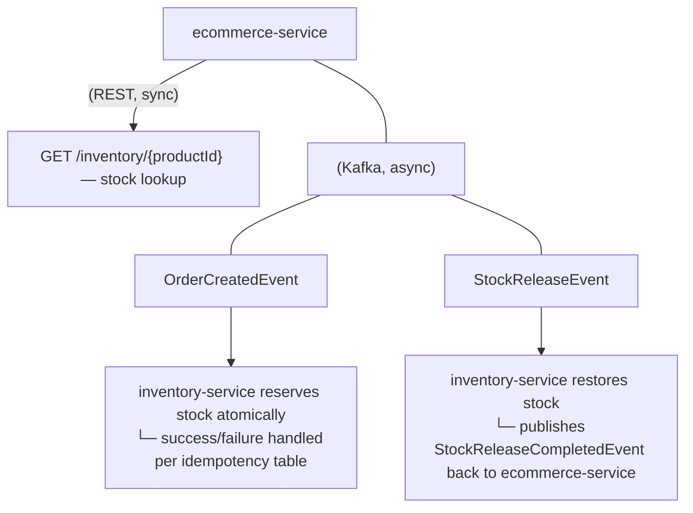

# Inventory Service
Owns product stock levels and participates in the order fulfillment saga initiated by the ecommerce service. 
Exposes stock data over REST for synchronous reads, and reserves/releases stock asynchronously via Kafka as part of the order flow.

## Architecture

## Key design decisions:
* Atomic stock reservation — stock is decremented via a single conditional UPDATE ... WHERE stock >= ? query rather than a read-then-write pattern guarded by application-level locking. This prevents overselling under concurrent order placement without needing pessimistic/optimistic locking.
* Idempotent consumers — both OrderCreatedEvent and StockReleaseEvent are processed through a tracking table keyed by order ID, checked before any stock mutation runs. This means Kafka's at-least-once delivery (and the upstream outbox's retry behavior) can never cause a stock quantity to be decremented or restored twice for the same order.
* Compensating action on payment failure — releasing stock after a failed payment is itself published as an event (StockReleaseCompletedEvent) back to the ecommerce service, so the order's final state is only set once the compensating action has actually completed — not assumed to have succeeded.

## Tech stack
Java · Spring Boot · Spring Data JPA · Spring Security (JWT) · PostgreSQL · Apache Kafka · Maven

## API overview
Endpoint	Description
GET /inventory/{productId}	Get current stock level for a product
GET /inventory	List stock levels
POST /inventory/{productId}	Create a stock record for a product
PATCH /inventory/{productId}	Adjust stock level for a product

Stock changes driven by the order saga (reservation on order creation, release on payment failure) happen via Kafka consumers, not these REST endpoints — the REST API is for direct stock lookups and inventory creation.

## Running locally
Prerequisites
Java 21
Maven
PostgreSQL
Apache Kafka (same broker as ecommerce-service)
Configuration

Set the following in application.yml / environment variables before running:

yaml
spring:
  datasource:
    url: jdbc:postgresql://localhost:5432/inventory
    username: <db-username>
    password: <db-password>
  kafka:
    bootstrap-servers: localhost:9092

jwt:
  secret: <same HMAC secret used by ecommerce-service, for validating incoming JWTs>
Build & run
bash
mvn clean install
mvn spring-boot:run

Known limitations / roadmap
No automated test suite yet beyond the default Spring Boot context-load test — coverage for the atomic update query and idempotent consumer logic is a priority addition.
No explicit Kafka consumer retry/backoff or dead-letter topic configuration — currently relies on Spring Kafka defaults.
Logging currently uses System.out.println in places; migrating to SLF4J is planned.
